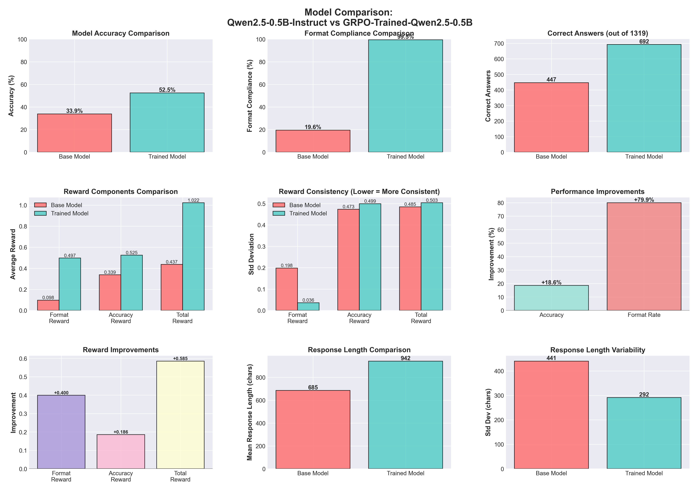
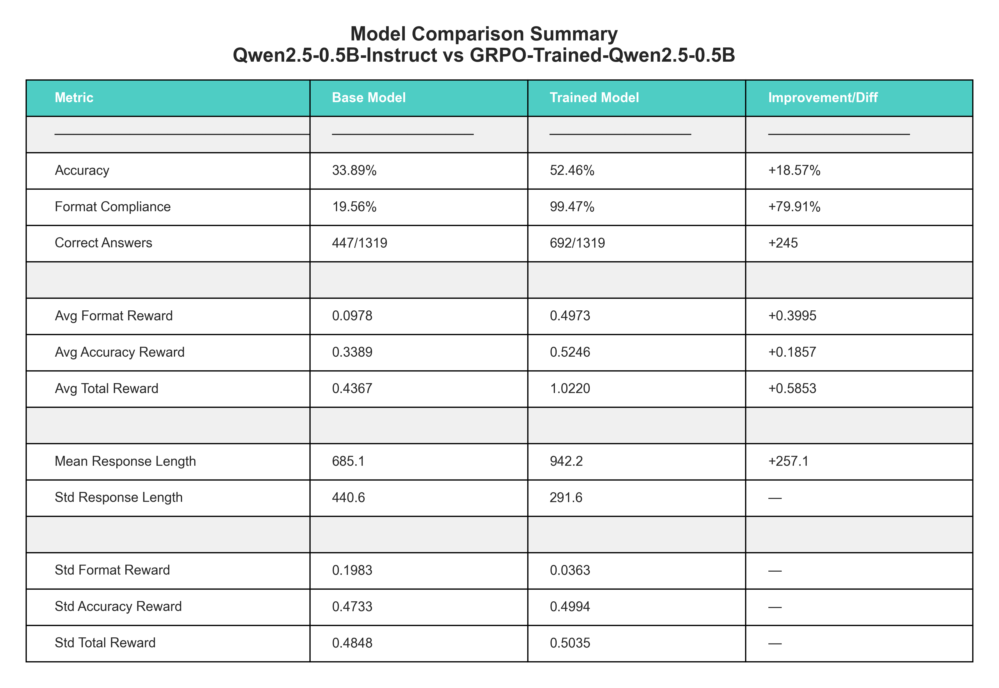
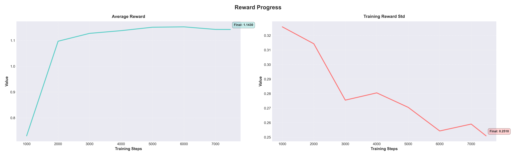
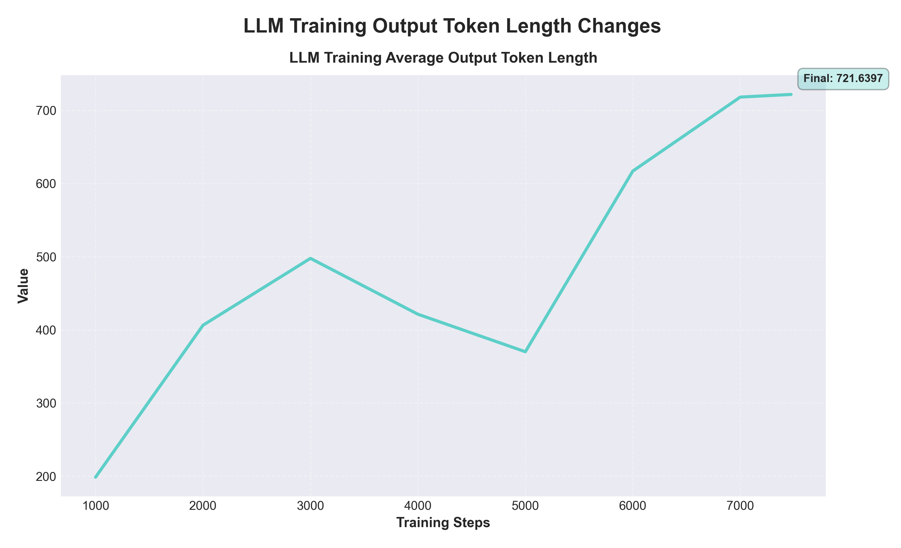

# GRPO Math Training

Fine-tuning Qwen2.5-0.5B on GSM8K mathematical reasoning using GRPO (Group Relative Policy Optimisation) from Hugging Face TRL. Inspired by [DeepSeekMath](https://arxiv.org/abs/2402.03300) and [DeepSeek-R1](https://arxiv.org/abs/2501.12948).

## Results

### Performance Charts


### Summary Table


### Training Information
<!--  -->



GRPO training improves both accuracy and format compliance on mathematical reasoning tasks. The trained model learns to provide structured answers in `<answer>...</answer>` tags while maintaining reasoning quality.

## Pre-trained Model

A trained model is available in `grpo-math-models/` with training logs in `logs/`. Evaluation results are in `comparison_results.json` and `visualisations/comparison_examples.html`.

## Quick Start

```bash
# Install dependencies
pip install -r requirements.txt

# Train on GSM8K dataset
python src/train_minimal.py

# Compare models
python src/compare_models.py
```

## Training

The training script applies GRPO with custom reward functions:
- **Format reward (0.5):** Checks for `<answer>...</answer>` tags
- **Accuracy reward (1.0):** Validates numerical correctness

```bash
# Full training (~7.5K examples, 1 epoch)
python src/train_minimal.py

# Quick test (100 examples)
python src/train_minimal.py --test
```

Uses LoRA for efficient fine-tuning on consumer GPUs. Training checkpoints saved every 500 steps to `grpo-math-models/`.

## Evaluation

```bash
# Full test set (1,319 examples)
python src/compare_models.py

# Quick evaluation
python src/compare_models.py --num_samples 50

# Generate graphical comparison
python src/visualize_comparison.py

# Generate page to view example outputs
python src/visualize_examples.py
```

Outputs detailed metrics and example comparisons to `comparison_examples.json`.

## Project Structure

```
src/
├── train_minimal.py                 # Main GRPO training script
├── train_grpo_with_reward_model.py  # Training with more complex reward model
├── compare_models.py                # Model evaluation and comparison to base model
├── utils.py                         # Shared utilities
├── visualize_comparison.py          # Generate comparison visualisations
└── visualize_examples.py            # Visualise example outputs

grpo-math-models/                    # Trained model checkpoints
visualisations/                      # Output graphs and HTML reports
```

## Requirements

- Python 3.8+
- 16GB+ RAM
- NVIDIA GPU with 6GB+ VRAM (recommended)
- CUDA-enabled PyTorch 2.5.1
